  

I build products end to end, from the database to the app in your hand. I've founded a mobility startup, won multiple hackathons, and now I run an AI studio shipping agent systems for clients on three continents.

### What I've built

**🤖 Flominds AI**, founder
An AI automation and growth-engineering studio for SMBs in the US and the Gulf. We design multi-agent systems, n8n pipelines, and fullstack AI products, then keep them running after launch.

**🚗 [Cruze](https://www.instagram.com/cruze.pakistan/)**, founder and lead engineer
Institutional carpooling for Pakistan. Universities and offices subscribe, and Cruze matches their people into daily carpools, including across institutions. I spent three years architecting the whole stack: the mobile app, APIs, database, and payments. Incubated at SSKIC, IoBM.

**🛰️ Geomagnetic storm prediction**: 1st place, NASA Space Apps Karachi
An AI system that forecasts geomagnetic storms from space-weather data.

### Right now

- Building ML pricing models for the insurance industry
- Shipping custom AI applications for Flominds clients
- Taking Cruze into universities and corporate campuses

### Stack

  

Plus LangChain, LangGraph, n8n, LightGBM, and the usual data stack.

### Get in touch

[LinkedIn](https://www.linkedin.com/in/rafay-abbas-3a8b31226/) · [Email](mailto:rafayabbas10@gmail.com)
